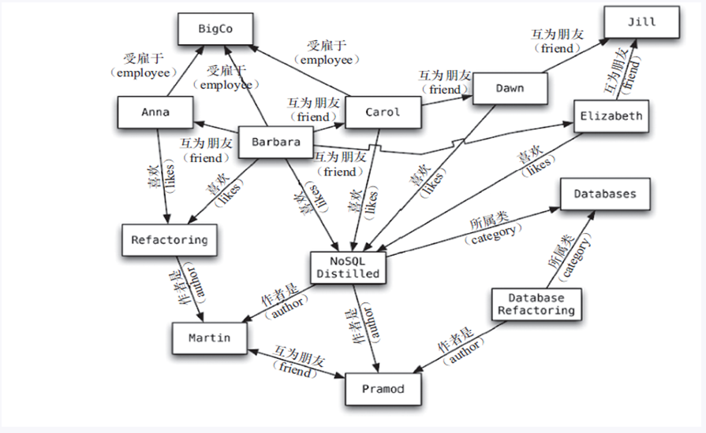

##### NoSQL 入门概述

1. 为什么要用 NoSQL（发展历程）<!-- more -->

    - 单机 MySQL

        90 年代，一个网站的访问量一般都不大，用单个数据库完全可以应付。更多的都是静态网页，动态交互类型的网站不多。

        

        上述架构下，数据存储的瓶颈：

        1. 数据量的总大小一台机器放不下时
        2. 数据的索引（B+Tree）一个机器的内存放不下时
        3. 访问量（读写混合）一个实例不能承受

    - Memcached（缓存）+ MySQL + 垂直拆分

        随着访问量的上升，几乎大部分使用 MySQL 架构的网站在数据库上都开始出现了性能问题，Web 程序不再仅仅专注在功能上，同时也在追求性能。开发者们开始大量的使用缓存技术来缓解数据库的压力，优化数据库的结构和索引。开始比较流行的是通过文件缓存来缓解数据库的压力，但是当访问量继续增大的时候，多台 Web 机器通过文件缓存不能共享，大量的小文件缓存也带来了比较高的 I/O 压力。在这个时候，Memcached 就自然的成为了流行的产品。

        

        Memcached 作为一个独立的分布式的缓存服务器，为多个 Web 服务器提供了 一个共享的高性能缓存服务，在 Memcached 服务器上，又发展了根据 hash 算法来进行多台 Memcached 缓存服务的扩展，然后又出现了一致性 hash 来解决增加或减少缓存服务器导致重新 hash 带来的大量缓存失效的弊端。

    - MySQL 主从读写分离

        由于数据库的写入压力增加，Memcached 只能缓解数据库的读取压力。读写集中在一个数据库上让数据库不堪重负，大部分网站开始使用主从复制技术来达到读写分离，以提高读写性能和读库的可扩展性。MySQL 的 Master-Salver 模式成为这个时候的网站标配

        

    - 分库分表 + 水平拆分 + MySQL 集群

        在 Memcached 的高速缓存，MySQL 的主从复制，读写分离的基础之上，这时 MySQL 主库的写压力开始出现瓶颈，而数据量的持续猛增，由于 MyISAM 使用表锁，在高并发下会出现严重的锁问题，大量的高并发 MySQL 应用开始使用 InnoDB 引擎代替 MyISAM。同时，开始流行使用分库分表来缓解写压力和数据增长的扩展问题。这个时候，分库分表成了一个热门技术，也就在这个时候，MySQL 推出了还不太稳定的表分区。虽然 MySQL 推出了 MySQL Cluster 集群，但性能也不能很好满足互联网的要求，只是在高可靠性上提供了非常大的保证

        

    - MySQL 的扩展瓶颈
    
        MySQL 数据库也经常存储一些大文本字段，导致数据库表非常的大，在做数据库恢复的时候就非常的慢，不容易快速恢复数据库。比如 1000w 4KB 大小的文本就接近 40GB 的大小，如果能把这些数据从 MySQL 省去，MySQL 将变得非常的小。关系数据库很强大，但是它并不能很好的应付所有的应用场景。MySQL 的扩展性差（需要复杂的技术来实现），大数据下 I/O 压力大，表结构更改困难，正是当前使用 MySQL 的开发人员面临的问题
    
    - 目前的架构
    
        
    
    - 为什么 NoSQL
    
        今天我们可以通过第三方平台（如 Google、FaceBook 等）可以很容易的访问和抓取数据。用户的个人信息，社交网络，地理位置，用户生成的数据和用户操作日志已经成倍的增加。我们如果要对这些用户数据进行挖掘，那 SQL 数据库已经不适合这些应用了，NoSQL 数据库的发展能很好的处理这些大的数据
    
        

----

2. NoSQL 是什么
    - NoSQL（NoSQL = Not Only SQL），意为 “不仅仅是 SQL”
    - 泛指非关系型的数据库。随着 Web2.0 网站的兴起，传统的关系型数据库在应付 Web2.0 网站，特别是超大规模和高并发的 SNS 类型的 Web2.0 纯动态网站已经显得力不从心，暴露了很多难以克服的问题，而非关系型的数据库则由于其本身的特点得到了非常迅速的发展。NoSQL 数据库的产生就是为了解决大规模数据集合多重数据种类带来的挑战，尤其是大数据应用难题，包括超大规模数据的存储。例如 Google 或 FaceBook 每天为他们的用户收集万亿比特的数据。这种类型的数据存储不需要固定的模式，无需多余的操作就可以横向扩展

----

3. NoSQL 特点
    - 易扩展。NoSQL 数据库种类繁多，但是一个共同的特点就是都是去掉关系数据库的关系型特性。数据之间无关系，这样就非常容易扩展，也在无形之间，在架构的层面上带来了可扩展的能力
    - 大数据量高性能。NoSQL 数据库都具有非常高的读写性能，尤其在大数据量下，同样表现优秀。这得益于它的无关系性，数据库的结构简单。一般 MySQL 使用 Query Cache，每次表的更新 Cache 就会失效，是一种大粒度的 Cache，在针对 Web2.0 的交互频繁的应用，Cache 性能不高。而 NoSQL 的 Cache 是记录级的，是一种细粒度的 Cache，所以 NoSQL 在这个层面上来说性能就要高很多
    - 多样灵活的数据模型。NoSQL 无须事先为要存储的数据建立字段，随时可以存储自定义的数据格式。而在关系数据库中，增删字段是一件非常麻烦的事。如果是非常大的数据量的表，增加字段简直就是一个噩梦
    - 传统 RDBMS 与 NoSQL 的区别
        1. RDBMS
            - 高度组织化结构化数据
            - 结构化查询语言（SQL）
            - 数据和关系都存储在单独的表中
            - 数据操纵语言，数据定义语言
            - 严格的一致性
            - 基础事务
        2. NoSQL
            - 代表着不仅仅是 SQL
            - 没有声明性查询语言
            - 没有预定义的模式
            - Key-Value 存储，列存储，文档存储，图形数据库
            - 最终一致性，而非 ACID 性
            - 非结构化和不可预知的数据
            - CAP 和 BASE

---

4. NoSQL 数据模型简介

    - 聚合模型

        - Key-Value 键值对

        - BSON（Binary JSON，是一种类 JSON 的一种二进制形式的存储格式，它和 JSON 一样，支持内嵌的文档对象和数据对象）

        - 列族（顾名思义，是按列存储数据的，最大的特点是方便存储结构化和半结构化数据，方便做数据压缩，对针对某一列或者某几列的查询有非常大的 I/O 优势）

            

        - 图形

            

---

5. NoSQL 数据库的四大分类

    - Key-Value 键值对：BerkeleyDB、Redis、Tair、Memcache

    - 文档型数据库（BSON 格式较多）：CouchDB、MongoDB

    - 列存储数据库：Cassandra、HBase、分布式文件系统

    - 图关系数据库：Neo4J、InfoGrid（应用于社交网络、推荐系统等，专注于构建关系图谱）

    - 四者对比

        

----

6. 分布式数据库中 CAP 原理 + BASE

    - 传统的 ACID。关系型数据库遵循 ACID 原则

        - A（Atomicity）原子性。原子性指的是一个事务中的所有操作要么全部完成，要么全部都放弃，事务成功的条件是事务里的所有操作都成功，只要有一个操作失败，那么整个事务就会失败，这时需要回滚。比如银行转账，从 A 账户转 100 元到 B 账户，分为两个步骤：① 从 A 账户中取 100 元；② 存入至 B 账户。这两步要么全部一起完成，要么都失败，如果只完成第一步，第二步失败，钱就会莫名其妙的少了 100 元
        - C（Consistency）一致性。一致性是指数据库要一直处于一致的状态，事务的运行不会改变数据库原本的一致性约束
        - I（Isolation）独立性。独立性是指并发的事务之间不会互相影响，如果一个事务要访问的数据正在被另外一个事务修改，只要另外一个事务未提交，它所访问的数据就不受未提交事务的影响。比如有个交易是从 A 账户转 100 元至 B 账户，在这个交易还未完成的情况下，如果此时 B 查询自己的账户，是看不到新增加的 100 元的
        - D（Durability）持久性。持久性是指事务一旦提交后，它所做的修改将会永久保存在数据库上，即使出现宕机也不会丢失

    - CAP 原理

        - C（Consistency）强一致性
        - A（Availability）可用性
        - P（Partition Tolerance）分区容错性

    - CAP 的三选二。CAP 原理是指在分布式存储系统中，最多只能实现 CAP 中的两个。而由于当前的网络硬件肯定会出现延迟丢包等问题，所以分区容错性是必须要实现的。故只能在一致性和可用性之间进行权衡，没有 NoSQL 系统能同时保证 CAP 三点。

        - CA：保证强一致性和高可用性。传统 Oracle 数据库
        - AP：保证高可用性和分区容错性。大多数网站架构的选择
        - CP：保证强一致性和分区容错性。Redis、Mongodb

        注：建立分布式架构时必须做出取舍。一致性和可用性之间取一个平衡。大多数 Web 应用其实并不需要强一致性。因此可以选择牺牲强一致性换取分区容错性

    - 经典 CAP 图。CAP 原理的核心是：一个分布式系统不可能同时很好的满足一致性、可用性和分区容错性这三个需求，最多只能同时较好的满足其中的两个。因此，根据 CAP 原理将 NoSQL 数据库分成了满足 CA 原则、满足 CP 原则和满足 AP 原则三大类

        - CA：单点集群，满足一致性、可用性的系统。通常在可扩展性上不强

        - CP：满足一致性、分区容错性的系统。通常性能不是特别好

        - AP：满足可用性、分区容错性的系统，通常对一致性的要求较低

            

    - BASE。BASE 就是为了解决关系数据库强一致性引起的可用性降低而提出的解决方案。它的思想是通过让系统放松对某一时刻数据一致性的要求来换取系统整体伸缩性和性能上的改观。原因在于大型系统往往由于地域分布和极高性能的要求，不可能采用分布式事务来完成这些指标，要想获得这些指标，我们必须采用另外一种方式来完成。这里 BASE 就是解决这个问题的办法

        - Basically Available：基本可用
        - Soft State：软状态
        - Eventually Consistent：最终一致

    - 分布式 + 集群简介

        - 分布式系统（Distributed System）：由多台计算机和通信的软件组件通过计算机网络连接（本地网络或广域网）组成。分布式系统是建立在网络之上的软件系统。正是因为软件的特性，所以分布式系统具有高度的内聚性和透明性。因此，网络和分布式系统之间的区别更多的在于高层软件（特别是操作系统），而不是硬件。分布式系统可以应用在不同的平台上，如 PC、工作中、局域网和广域网上等。简单来讲，分布式就是不同的多台服务器上面部署不同的服务模块（工程），它们之间通过 RPC/RMI 来通信和调用，对外提供服务和组内协作
        - 集群：不同的多台服务器上面部署相同的服务模块，通过分布式调度软件进行统一的调度，对外提供服务和访问

---

##### Redis 入门介绍

1. Redis 是什么
    - [Redis]( https://redis.io/ )：Remote Dictionary Server（远程字典服务器）。完全开源免费的，用 C 语言编写的，遵守 BSD 协议，是一个高性能的（Key-Value）分布式内存数据库，基于内存运行，并支持持久化的 NoSQL 数据库，是当前最热门的 NoSQL 数据库之一，也被称为数据结构服务器
    - Redis 支持数据的持久化，可以将内存中的数据保存在磁盘中，重启的时候可以再次加载
    - Redis 不仅仅支持简单的 Key-Value 类型的数据，同时还提供 List、Set、ZSet、Hash 等数据结构的存储
    - Redis 支持数据的备份，即 Master-Slave 模式的数据备份

----

2. Redis 的作用
    - 内存存储和持久化：Redis 支持异步将内存中的数据写到硬盘上，同时不影响继续服务
    - 取最新 N 个数据的操作，如可以将最新的 10 条评论的 ID 放在 Redis 的 List 集合中
    - 模拟类似于 HttpSession 这种需要设定过期时间的功能
    - 发布-订阅模式
    - 定时器、计数器

----

3. Redis 的安装（以 5.0.6 版本为例，详细可以进官网看）

```shell
# 建议先进入 /opt 目录再进行下载
# 或是手动下载再将文件移入 /opt 目录进行解压
wget http://download.redis.io/releases/redis-5.0.6.tar.gz

# 解压
tar -zxvf redis-5.0.6.tar.gz

# 进入解压目录
cd redis-5.0.6

# 编译(需要安装 GCC)
make

# 注：出现 Jemalloc/jemalloc.h: 没有那个文件或目录错误时, 
# 运行 make distclean 再 make

# 编译完成后执行安装
make install
```

默认安装目录为：/usr/local/bin

- redis-benchmark：性能测试工具（在 Redis 服务启动后执行）
- redis-check-aof：修复格式不正确的 AOF 文件
- redis-check-rdb：修复格式不正确的 dump.rdb 文件（老版本叫 redis-check-dump）
- redis-cli：客户端操作入口
- redis-server：Redis 服务器启动命令
- redis-sentinel：Redis 集群使用（哨兵模式）

----

4. Redis 启动
    - 复制一份 redis.conf 到自定义目录
    - 将复制出来的 redis.conf 中的 `daemonize no` 改为 `yes`，让 redis 服务在后台启动
    - 使用 `redis-server /自定义目录路径/redis.conf`命令来启动 Redis 服务器
    - 使用 `redis-cli -h IP 地址 -p 端口 -a 密码` 来连接至刚刚启动的 Redis 服务器。连接成功后进行 `ping` 测试（成功会返回 PONG）
    - 在 redis-cli 中使用 `SHUTDOWN` 命令即可关闭 Redis 服务器。可以通过 `ps -ef|grep redis` 查询后台是否还有 Redis 服务在运行。单实例关闭：`redis-cli SHUTDOWN` 。多实例关闭需要指定端口号：`redis-cli -p 6379 SHUTDOWN`
    - Redis 是单进程的（多进程版本目前已经在规划当中）。单进程模型来处理客户端的请求，对读写事件的响应是通过 epoll 函数的包装来做到的。Redis 的实际处理速度完全依靠主进程的执行效率。Epoll 是 Linux 内核为处理大批量文件描述符而做了改进的 epoll，是 Linux 下多路复用 I/O 接口 select/poll 的增强版本，它能显著提高程序在大量并发连接中只有少量活跃的情况下的系统 CPU 利用率
    - Redis 默认有 16 个数据库（见 redis.conf 配置文件中 `database 16`）。类似数字下标从 0 开始，初始默认使用 0 号库。可以使用 `SELECT <dbid>` 命令在连接上切换数据库
    - `DBSIZE` 命令查看当前数据库 Key 的数量
    - `FLUSHDB` 命令清空当前数据库
    - `FLUSHALL` 命令清空所有数据库
    - 统一密码管理。16 个数据库都是同样的密码，要么都能连接上，要么一个都连接不上
    - Redis 索引都是从 0 开始
    - 默认端口为 6379 原因（MERZ）

----

##### Redis 数据类型

1. Redis 五大数据类型

    - String：字符串。String 是 Redis 最基本的数据类型，可以理解成于 Memcached 一模一样的类型，一个 Key 对应一个 Value。String 类型是二进制安全的，意思是 Redis 的 String 可以包含任何数据，比如 JPG 格式的图片或者序列化的对象。一个 Redis String 中 Value 最多可以是 512M
    - Hash：Redis Hash 是一个键值对的集合。它是一个 String 类型的 field 和 value 的映射表，Hash 特别适合存储对象。类似于 Java 中的 Map\<String, Object\>
    - List：Redis List 是最简单的字符串列表，按照插入顺序排序。可以添加一个元素至列表的表头（左边）或者尾部（右边）。底层是一个链表
    - Set：Redis Set 是 String 类型的无序集合。通过 HashTable 实现
    - Zset(Sorted Set)：Redis Sored Set 与 Set 一样也是 String 类型元素的集合，且不允许有重复的成员。与 Set 不同的是，每个元素都会关联一个 Double 类型的分数。Redis 通过分数来为集合中的成员进行从小到大的排序。Sorted Set 的成员是唯一的，但是分数却是可以重复的

2. [Redis 键（Key）常用命令]( https://redis.io/commands#generic )
- `KEYS pattern` ：查找所有符合给定模式（pattern）的 Key。常用 `KEYS *`
    - `EXISTS key` ：判断某个 Key 是否存在
    - `MOVE key db` ：将当前数据库的 Key 移动到给定的数据库 db 中
    - `EXPIRE key seconds` ：为给定 Key 设置过期时间
    - `TTL key` ：以秒为单位返回 Key 的剩余过期时间。-1 表示永不过期，-2 表示已过期
    - `TYPE key` ：返回 Key 所存储的值的类型
    
3. [Redis 字符串（String）常用命令（注：单值单 value）]( https://redis.io/commands#string )

    - `SET/GET/DEL/APPEND/STRLEN`
    - `INCR/DECR/INCRBY/DECRBY` （一定要是数字才能进行加减）
    - `GETRANGE/SETRANGE` ：`GETRANGE` 表示获取指定区间范围内的值，类似 `BETWEEN...AND` 的关系。从 0 到 -1 表示全部。`SETRANGE` 设置指定区间范围内的值，格式是 `SETRANGE key offset value` （用 value 参数覆写给定 key 所存储的字符串值，从偏移量 offset 开始）
    - `SETEX(set with expire) 键秒值/SETNX(set if not exist)` ：`SETEX key seconds value` 将值 value 关联到 key，并将 key 的过期时间设为 seconds（以秒为单位）。`SETNX key value` 只有在 key 不存在时设置 key 的值
    - `MSET/MGET/MSETNX` ：M 表示 more，多个，其他与 `SET/GET/SETNX` 一致
    - `GETSET key value` ：将给定的 key 值设为 value，然后返回 key 的旧值（old value）

4. [Redis 列表（List）常用命令（注：单值多 value）]( https://redis.io/commands#list )

    - `LPUSH/RPUSH/LRANGE` ：`LRANGE key start stop` 获取列表指定范围内的元素
    - `LPOP/RPOP key` ：弹出并获取列表的第一个元素/最后一个元素
    - `LINDEX key index` ：通过 index 获取列表中的元素
    - `LLEN key` ：获取列表长度
    - `LREM key count value` ：弹出列表元素
    - `LTRIM key start stop` ：对一个列表进行 trim，让列表只保留指定区间内的元素，不在指定区间内的元素都将被删除
    - `RPOPLPUSH source destination` ：弹出列表中的最后一个元素，并将该元素添加到另一个列表并返回
    - `LSET key index value` ：通过 index 设定列表元素的值
    - `LINSERT key BEFORE/AFTER value1 value2` ：在列表的元素前或者元素后插入元素
    - List 是一个字符串链表，Left、Right 都可以插入添加。如果键不存在，创建新的链表。如果键已存在，新增内容。如果键全移除，对应的键也就消失了。链表的操作无论头尾都效率极高，而中间元素的操作效率就很低

5. [Redis 集合（Set）常用命令（注：单值多 value）]( https://redis.io/commands#set )

    - `SADD/SMEMBERS/SISMEMBER` ：见官方文档
    - `SCARD key` ：获取集合的成员数
    - `SREM key member1 member2` ：移除集合中一个或多个成员
    - `SRANDMEMBER key [count]` ：返回集合中一个或多个随机数
    - `SPOP key` ：移除并返回集合中一个随机元素
    - `SMOVE source destination member` ：将 member 元素从 source 集合移动到 destination 集合
    - `SDIFF` ：差集
    - `SINTER` ：交集
    - `SUNION` ： 并集

6. [Redis 哈希（Hash）常用命令（注：KV 模式不变，但 V 是一个键值对）]( https://redis.io/commands#hash )

    - `HSET/HGET/HMSET/HMGET/HGETALL/HDEL` ：见官方文档
    - `HLEN key` ：获取 Hash 表中字段数量
    - `HEXISTS key field` ：查看 Hash 表中 key，指定的字段是否存在
    - `HKEYS/HVALS key` ：获取 Hash 表中所有字段/获取 Hash 表中所有值
    - `HINCRBY/HINCRBYFLOAT key field increment` ：为 Hash 表中 key 中的指定字段的整数值/浮点值加上增量 increment
    - `HSETNX key field value` ：只有当字段 field 不存在时，才会设定 Hash 表字段的值

7. [Redis 有序集合（ZSet/Sorted Set）常用命令]( https://redis.io/commands#sorted_set )

    - `ZADD key score1 member1 [score2 member2]` ：向有序集合添加一个或多个成员，或者更新已存在成员的分数
    - `ZRANGE key start stop [WITHSCORES]` ：通过索引区间返回有序集合指定区间内的成员
    - `ZRANGEBYSCORE key start stop [WITHSCORES] [LIMIT]` ：`(` 表示不包含; `Limit` 是返回限制。通过分数返回有序集合指定区间内的成员
    - `ZREM key member [member...]` ：移除有序集合中的一个或多个成员
    - `ZCARD key/ZCOUNT key min max` ：`ZCARD` 获取有序集合的成员数；`ZCOUNT` 计算在有序集合中指定区间分数的成员数
    - `ZRANK key member` ：返回有序集合中指定成员的索引
    - `ZSCORE key member` ：返回有序集合中，成员的分数值
    - `ZREVRANK key member` ：返回有序集合中指定成员的排名，有序集成员按分数值递减（从大到小）排序
    - `ZREVRANGE key start stop [WITHSCORES]` ：返回有序集中指定区间内的成员，通过索引，分数从高到底
    - `ZREVRANGEBYSCORE key max min` ：返回有序集中指定分数区间内的成员，分数从高到低排序

##### Redis 配置文件(redis.conf)

1. 配置文件位置：在运行 `make` 命令的文件夹中，与 src 目录同级

----

2. Units：配置文件开头定义了一些基本的度量单位，只支持 bytes，不支持 bit，并且对大小写不敏感

----

3. INCLUDES：可以通过 include 导入其他配置文件，redis.conf 作为总的

----

4. GENERAL
    - daemonize：是否作为守护进程启动，默认为 no
    - pidfile：指定 pid 文件名，daemonize 为 yes 时，会把 pid 写入 pidfile，默认为 `/var/run/redis.pid`
    - port：指定 Redis 监听端口，默认为 6379
    - tcp-backlog：设置 tcp 的 backlog，backlog 其实是一个连接队列，backlog 队列总和 = 未完成三次握手队列 + 已经完成三次握手队列。在高并发环境下需要一个高 backlog 值来避免慢客户端连接问题。注意 Linux 内核会将这个值减小到 `/proc/sys/net/core/somaxconn` 的值，所以需要确保提高 somaxconn 和 tcp_max_syn_backlog 两个值来达到想要的效果
    - timeout：当客户端闲置多长时间后关闭连接，如果指定为 0，表示关闭该功能，永不超时
    - bind：绑定的主机地址，默认为 127.0.0.1。若不绑定任何主机地址，Redis 会监听任何可用连接
    - tcp-keepalive：检测已连接的客户端是否存活，默认为 300，单位秒。若为 0 则不会进行存活检测。建议设置为 60
    - loglevel：指定日志级别，默认为 notice。Redis 中有四个日志级别：debug、verbose、notice、warning
    - logfile：指定日志文件名，默认为 standard output（即设置空字符串），若 logfile 指定为标准输出，而 Redis 又是以守护进程的方式启动，则日志会被发送至 `/dev/null`
    - syslog-enabled：是否把日志输出到 syslog 中，默认为 no
    - syslog-ident：指定 syslog 中的日志标志，默认为 redis
    - syslog-facility：指定 syslog 设备，值必须是 USER 或 LOCAL0 - LOCAL7
    - databases：数据库数量，默认为 16 个
    - protected-mode：是否启用保护模式，默认为 yes。若启用保护模式，则 Redis 只接受来自 bind 指令绑定 ip 的连接请求，如果 bind 指令未明确指定 ip，且认证密码也未配置，则只接受来自 127.0.0.1 和 localhost 的连接请求

----

5. SNAPSHOTTING
    - save：默认有三组：`save 900 1` 、`save 300 5` 、`save 60 10000`。格式为 save \<seconds\> \<changes\>，默认的配置意思为：15 分钟内修改了 1 次、5 分钟内修改了 10 次、1 分钟内修改了 10000 次，满足上述条件之一就会触发 RDB 备份。若不想使用 RDB 备份，则可以将所有的 save 指令注释掉，或者改为 `save “”` ，即传入一个空字符串
    - stop-writes-on-bgsave-error：默认为 yes。若配置为 no，表示你不在乎数据的一致性或者有其他的手段发现数据的不一致并控制数据的一致性
    - rdbcompression：默认为 yes。表示是否启用对 RDB 的压缩存储，默认会采用 LZF 算法进行压缩。若不想消耗 CPU 资源来进行压缩，可以将其关闭（但会消耗硬盘空间）。
    - rdbchecksum：默认为 yes。表示在存储 RDB 快照后，是否启用 CRC64 算法来进行数据校验，这么做会增加大约 10% 的性能损耗，若希望有较大的性能提升，可以关闭数据校验
    - dbfilename：默认为 `dump.rdb`。RDB 快照名
    - dir：默认为当前配置文件所在位置。RDB 快照存储位置

----

6. SECURITY
    - requirepass：配置访问密码，默认是注释掉的。因为 Redis 认为大多数的 Redis 服务器并不是暴露在外网下的，所以不存在安全问题。若启用了该项并设置了密码，那么在首次连接上 Redis 服务器时需要通过 `AUTH <PASSWORD>` 来认证才能使用一系列命令
    - rename-command：重命名命令。可以通过这个指令来将命令重命名，就算认证密码被破解，也无法对 Redis 服务器造成实质性伤害。也可以直接配置空字符串将这个命令禁用。但是更改记录到 AOF 文件的命令和主从复制相关命令的名称可能会出问题

----

7. LIMITS
    - maxclients：设置同时连接的最大客户端数量。默认为 10000，若已经达到 maxclients 设定的值后还有客户端要连入，则 Redis 会抛出一个 “max number of clients reached” 的错误信息。若 Redis 服务器无法配置进程文件句柄限制时，会将 maxclients 的值设为当前进程文件句柄值减 32 ，因为 Redis 得为自身内部逻辑预留出一些来使用
    - maxmemory：设置 Redis 可用的内存量（单位为 bytes），一旦达到内存使用上限，Redis 会尝试移除一些数据，移除规则通过 maxmeory-policy 来指定。如果 Redis 无法根据移除规则来移除内存中的数据，或者移除规则设定为 `noeviction` ，那么 Redis 会针对那些需要申请内存的命令返回错误信息，如 SET、LPUSH 等。但是对于无内存申请的指令，仍然会正常响应，如 GET 等。建议为身份为 Master 的 Redis 服务器（说明它有 Slave）设置内存使用上限时预留出一些内存空间给同步队列缓存，只有在设置移除规则为 `noeviction` 时才不用考虑这个因素
    - maxmemory-policy：到达内存上限时采取的移除策略。默认使用 `noeviction`
        - volatile-lru：针对设置了过期时间的 key 使用 LRU 算法进行移除
        - allkeys-lru：使用 LRU 算法移除所有的 key
        - volatile-lfu：针对设置了过期时间的 key 使用 LFU 算法进行移除
        - allkeys-lfu：使用 LFU 算法移除所有的 key
        - volatile-random：随机移除设置了过期时间的 key
        - allkeys-random：移除随机的 key
        - volatile-ttl：移除那些 TTL 值最小的 key，即最近要过期的 key
        - noecivtion：不移除任何 key，对任何写操作返回错误信息
    - maxmemory-samples：设置样本数量，LRU、LFU、TTL 都不是精确的算法，而是估算值。默认样本数量为 5，可用得出较好的结果；若设为 10 则会非常接近真正的 LRU/LFU 但是会消耗更多的 CPU 资源；若设为 3 则会很快但是结果不会很精确

----

8. APPEND ONLY MODE
    - appendonly：是否开启 AOF，默认为 no
    - appendfilename：AOF 文件名，默认为 `appendonly.aof`
    - appendfsync：持久化同步模式。默认为 `everysec`
        - always：每次发生数据变更都会立即记录到硬盘，性能较差但数据完整性较好（慢但最安全）
        - everysec：每秒同步一次，异步操作，如果一秒内宕机，会有数据丢失（但是恢复很容易）（折中）
        - no：表示等操作系统将数据缓存同步到硬盘（快）
    - no-appendfsync-on-rewrite：重写时是否可以使用 appendfsync，使用默认的 no 即可，保证数据的安全性
    - auto-aof-rewrite-min-size：设置重写的基准值。详细机制见持久化中的 Rewrite 部分
    - auto-aof-rewrite-percentage：设置重写的基准百分比。当 AOF 日志文件大小到指定的百分比时，Redis 会自动进行重写。这个值指定为 0 时则会禁用自动重写机制。详细机制见持久化中的 Rewrite 部分

----

9. 常用的 redis.conf 配置

    - daemonize no

        Redis 默认不是以守护进程的方式运行，可以通过修改该配置项启用守护进程

    - pidfile /var/run/redis.pid

        当 Redis 以守护进程方式运行时，Redis 默认会把 pid 写入 /var/run/redis.pid 文件，可以通过 pidfile 指定

    - port 6379

        指定 Redis 监听端口，默认为 6379

    - bind 127.0.0.1

        绑定的主机地址

    - timeout 300

        当客户端闲置多长时间后关闭连接，如果指定为 0，表示永不超时

    - loglevel notice

        指定日志级别，Redis 支持四个日志级别：debug、verbose、notice、warning 等。默认为 notice

    - logfile “”

        指定日志记录方式，为空字符串则表示使用 standard out。若 Redis 为守护进程方式运行，而这里又配置日志记录方式为 standard out，那么日志将会发送至 /dev/null

    - databases 16

        设置数据库的数量，默认数据库数量为 16 个，默认数据库为 0，可以使用  `SELECT <dbid>` 命令在连接上指定数据库 id

    - save \<seconds\> \<changes\>

        指定在多长时间内，有多少次更新操作，就将数据同步到数据文件，可以多个条件配合。Redis 配置文件中提供了三个条件：

        save 900 1

        save 300 10

        save 60 10000

        分别表示 900 秒（15分钟）内有 1 个更改，300 秒（5 分钟）内有 10 个更改以及 60 秒内有 10000 个更改

    -  rdbcompression yes

        指定存储至本地数据库时是否压缩数据，默认为 yes，Redis 采用 LZF 算法压缩，如果为了节省 CPU 资源，可以关闭该选项，但会导致数据库文件变得巨大

    - defilename “dump.rdb”

        指定本地数据库文件名，默认值为 dump.rdb

    - dir ./

        指定本地数据库存放目录

    - salveof \<masterip\> \<masterport\>

        设置当本机为 Slave 时，设置 Master 的 IP 地址和端口，在 Redis 启动时，它会自动从 Master 进行数据同步

    - masterauth \<master-password\>

        当 Master 设置了认证密码时，Slave 连接至 Master 的密码

    - requirepass foobared

        设置 Redis 认证密码，默认关闭。如果设置了认证密码，客户端在连接至 Redis 服务器时需要通过 `AUTH <password>` 命令提供认证密码

    - maxclients 128

        设置同一时间最大客户端连接数，默认为 10000，Redis 可以同时打开的客户端连接数为 Redis 进程可以打开的最大文件描述符数，如果设置 maxclients 0 则表示不做限制。当客户端连接数到达限制时，Redis 会关闭新的连接并向客户端返回  “max number of clients reached” 错误信息

    - maxmemory \<bytes\>

        指定 Redis 最大内存限制，Redis 在启动时会把数据加载至内存中，达到最大内存后，Redis 会尝试清除已过期或即将过期的 Key，当此方法处理后，仍然到达最大内存设置，将无法再进行写入操作，但仍然可以进行读取操作。Redis 新的 vm 机制，会把 Key 放在内存，Value 存放在 swap 区

    - appendonly no

        指定是否在每次更新操作后进行日志记录，Redis 在默认情况下是异步将数据写入硬盘，如果不开启，可能会在突然断电时导致一段时间内的数据丢失。因为 Redis 本身同步数据文件是根据 save 条件来同步的，所有有的数据会在一段时间内只存在于内存中。默认为 no

    - appendfilename “appendonly.aof”

        指定更新日志文件名，默认为 “appendonly.aof”

    - appendfsync everysec

        指定更新日志条件，共有三个可选值：

        no：表示等操作系统将数据缓存同步到硬盘（快）

        always：表示每次更新操作后手动调用 fsync() 将数据写入到硬盘（慢，安全）

        everysec：表示每秒同步一次（折中，默认值）

    - vm-enable no

        指定是否启用虚拟内存机制，默认为 no。VM 机制将数据分页存放，由 Redis 将访问量较少的页即冷数据 swap 到硬盘上，访问较多的页由硬盘自动 swap 到内存中

    - vm-swap-file /tmp/redis.swap

        虚拟内存文件路径，默认为 /tmp/redis.swap，不可多个 Redis 实例共享

    - vm-max-memory 0

        将所有大于 vm-max-memory 的数据存入虚拟内存，无论 vm-max-memory 设置多小，所有索引数据都是内存存储的（Redis 的索引数据就是 Keys），也就是说，当 vm-max-memory 设置为 0 时，其实是所有的 Value 都存在硬盘中，默认为 0

    - vm-page-size 32

        Redis swap 文件分成了很多的 page，一个对象可以保存在多个 page 上面，但一个 page 上不能被多个对象共享，vm-page-size 是要根据存储的数据大小来设定的，作者建议如果要存储很多小对象，page 大小最好设置为 32 或 64 bytes；如果存储很大的对象，则可以使用更大的 page，如果不确定，就使用默认值

    - vm-pages 134517728

        设置 swap 文件中的 page 数量，由于页表（一种表示页面空闲或使用的 bitmap）是放在内存中的，在硬盘上每 8 个 pages 将消耗 1 bytes 的内存

    - vm-max-threads 4

        设置访问 swap 文件的线程数，最好不要超过机器的核心数，如果设置为 0，那么所有的 swap 文件的操作都是串行的，可能会造成比较长时间的延迟。默认为 4

    - glueoutputbuf yes

        设置在向客户端应答时，是否把较小的包合并为一个包发送，默认开启

    - hash-max-zipmap-entries 64

        指定在超过一定数量或者最大的元素超过某一临界值时，采用一种特殊的 Hash 算法

    - hash-max-zipmap-value 512

        同上

    - activerehashing yes

        指定是否激活重置 Hash，默认为开启

    - include /path/to/local.conf

        指定包含其他的配置文件，可以在同一主机上多个 Redis 实例之间使用同一份配置文件，而同时各个实例又拥有自己的特定配置文件

----

##### Redis 的持久化

1. RDB(Redis Database)：在指定的时间间隔内将内存中的数据集快照写入硬盘，也就是 SnapShot 快照。它恢复时是将快照文件直接读入内存中。Redis 会单独创建（fork）一个子进程来进行持久化，会先将数据写入到一个临时文件中，待持久化过程都结束了，再用这个临时文件代替上次持久化好的文件。整个过程中，主进程是不进行任何 I/O 操作的，这就确保了极高的性能。如果需要进行大规模的数据恢复，且对于数据恢复的完整性不是很敏感，那 RDB 方式要比 AOF 方式更加的高效。RDB 的缺点是最后一次持久化后的数据可能会丢失

    - Fork：Fork 的作用是复制一个与当前进程一样的进程。新进程的所有数据（变量、环境变量、程序计数器等）数值都和原进程一致，但是是一个全新的进程，并作为原进程的子进程

    - RDB 保存的是 dump.rdb 文件

    - 配置位置：redis.conf 中的 SNAPSHOTTING 部分

    - 如何触发 RDB 快照

        - 在客户端做的操作达到配置文件中 SNAPSHOTTING 部分的条件
        - 命令 `save` 或者 `bgsave`。`save` 只管保存，其他的不管，全部阻塞。`bgsave` 会让 Redis 在后台异步进行快照保存操作，执行期间还可以响应客户端请求，可以通过 `lastsave` 命令获取最后一次成功执行快照的时间
        - 执行 `flushall` 命令也会产生 dump.rdb 文件，但里面是空的，无意义

    - 如何恢复

        - 将备份文件 dump.rdb 移动到 redis 安装目录并启动服务即可
        - `CONFIG GET dir` 获取目录

    - RDB 优点

        - 适合大规模的数据恢复
        - 对数据完整性和一致性要求不高

    - RDB 缺点

        - 在一定间隔时间做一次备份，所以如果 Redis 在这期间意外宕机，就会丢失掉最后一次快照后的所有修改
        - Fork 的时候，内存中的数据被克隆了一份，大约 2 倍的膨胀性需要考虑

    - 如何停止

        - 动态停止所有 RDB 保存规则的方法：`redis-cli config set save “”`

    - 总结

        

----

2. AOF(Append Only File)：以日志的形式来记录每个写操作，将 Redis 执行过的所有写指令记录下来（读操作不记录），只许追加文件但不许改写文件，Redis 启动之初会读取该文件重新构建数据，换句话说，Redis 重启的话就根据日志文件的内容将写命令从前到后执行一次以完成数据的恢复工作

    - AOF 保存的是 appendonly.aof 文件

    - 配置位置：redis.conf 中的 APPEND ONLY MODE 部分

    - AOF 启动/修复/恢复

        - 正常恢复
            - 启动：将默认的 appendonly no 改为 yes
            - 将有数据的 AOF 文件复制一份保存到对应目录（`config get dir`）
            - 恢复：重启 Redis 然后重新加载
        - 异常恢复
            - 启动：将默认的 appendonly no 改为 yes
            - 备份被写坏的 AOF 文件
            - 修复：`redis-check-aof --fix AOF文件名` 进行修复
            - 恢复：重启 Redis 然后重新加载

    - Rewrite：AOF 采用文件追加方式，文件必然会越来越大，为了避免出现这种情况，新增了重写机制。当 AOF 文件的大小超过所设定的阈值时，Redis 就会启动 AOF 文件的内容压缩，只保留可以恢复数据的最小指令集，可以使用命令 `bgrewriteaof`

        - 重写原理：AOF 文件持续增长而过大时，会 Fork 出一条新进程来将文件重写（也是先写临时文件最后再 rename），遍历新进程的内存中数据，每条记录有一条 Set 语句。重写 AOF 文件的操作，并没有读取旧的 AOF 文件，而是将整个内存中的数据库内容用命令的方式重写了一个新的 AOF 文件，这一点和快照有点相似
        - 触发机制：Redis 会记录上次重写时的 AOF 文件大小，默认配置是当 AOF 文件大小是上次重写后大小的一倍且文件大于 64M 时触发

    - AOF 优点

        - 每修改同步：appendfsync always，同步持久化，每次数据发生变更会立即被记录到硬盘，性能较差但数据完整性较好
        - 每秒同步：appendfsync everysec，异步操作，每秒记录，如果一秒内宕机，会有数据丢失
        - 不同步：appendfsync no，等操作系统进行数据缓存同步到硬盘

    - AOF 缺点

        - 相同数据集的数据而言，AOF 文件要远大于 RDB 文件，恢复速度慢于 RDB
        - AOF 运行效率要慢于 RDB，每秒同步策略较好，不同步效率和 RDB 相同

    - 总结

        

----

3. 总结
    - RDB 持久化方式能够在指定的时间间隔内对数据进行快照存储
    - AOF 持久化方式记录每次对服务器写的操作，当服务器重启的时候会重新执行这些命令来恢复原始的数据，AOF 命令以 Redis 协议追加保存每次写的操作到文件末尾。Redis 还能对 AOF 文件进行后台重写，使得 AOF 文件的体积不至于过大
    - 只做缓存：如果只希望数据在服务器运行的时候存在，可以不使用任何持久化方式
    - 同时开启两种持久化方式：在这种情况下，Redis 重启时会优先载入 AOF 文件来恢复原始的数据，因为通常情况下 AOF 文件保存的数据集要比 RDB 保存的数据集完整
    - RDB 的数据不实时，同时使用两者时服务器重启也只会找 AOF 文件，作者建议不要使用 AOF，因为 RDB 更适合用于备份数据库（AOF 在不断变化不好备份），快速重启，而且不会有 AOF 可能潜在的 bug，留着做一个以防万一的手段
    - 性能建议：因为 RDB 文件只用作后备用途，建议只在 Slave 上持久化 RDB 文件，而且只要 15 分钟备一次就好了，只保留 `save 900 1` 这条规则。如果开启 AOF，好处是在最恶劣的情况下也只会丢失不超过两秒的数据，启动脚本简单只 load 自己的 AOF 文件就可以了。代价一是带来了持续的 I/O，二是 AOF 重写的最后将重写过程中产生的新数据写到新文件造成的阻塞几乎是不可避免的。只要硬盘许可，应该尽量减少 AOF 重写的频率，AOF 重写的基础大小默认 64M 太小了，可以设到 5GB 以上。默认超过原大小 100% 大小时重写可以改到适当的数值。如果不开启 AOF，仅靠 Master-Slave Replication 实现高可用性也可以。能省掉一大笔 I/O 也减少了重写时带来的系统波动。代价是如果 Master-Slave 同时宕机，会丢失十几分钟数据，启动脚本也要比较两个 Master-Slave 中的 RDB 文件，载入较新的哪个

----

##### Redis 的事务

1. 事务：可以一次执行多个命令，本质是一组命令的集合。一个事务中的所有命令都会序列化，按顺序地串行化执行而不会被其他命令插入，禁止加塞

----

2. 事务的作用：一个队列中，一次性、顺序性、排他性地执行一系列命令

----

3. Redis 事务常用命令
    - `MULTI` ：开启事务
    - `EXEC` ：执行事务
    - `DISCARD` ：放弃事务
    - `WATCH key [key...]` ：监视一个或多个 Key，若在事务执行之前这个（这些）Key 被其他命令所改动，那么事务将会被打断
    - `UNWATCH` ：取消 `WATCH` 命令对所有 Key 的监视

---

4. 五种情况

    - 正常执行

        

    - 放弃事务（类似回滚）

        

    - 事务队列中全都不执行

        

    - 事务队列中谁错谁不执行，其他没错的都执行。与上面的区别是：上面是在输入命令回车之后直接抛出 Error ，而这个是在使用 `EXEC` 执行事务时才出现的错误

        

    - watch 监控

        - 悲观锁/乐观锁/CAS（Check And Set）
            - 悲观锁（Pessimistic Lock）：每次去数据库中取数据时都很悲观，认为别人会修改，所以每次在拿数据的时候都会上锁，这样别人想拿这个数据就会 block 直到它拿到锁。传统的关系型数据库中用到了很多这种锁机制，比如行锁、表锁、读锁、写锁等，都是在做操作之前先上锁
            - 乐观锁（Optimistic Lock）：每次去数据库中拿数据时都很乐观，认为别人不会修改，所以不会上锁，但是在更新时会判断一下在此期间别人有没有去更新这个数据，常用的是版本号机制。乐观锁适用于多读的应用类型，这样可以提高吞吐量。乐观锁策略：提交版本必须大于当前记录版本才能执行更新
            - Redis 的 CAS 主要通过 `WATCH` 命令来实现
        - 例子：银行转账
        - 小结：`WATCH` 命令，类似乐观锁，事务提交时，如果 Key 的值已经被别的客户端修改，那么整个事务队列都不会被执行。通过 `WATCH` 命令在事务执行之前监控了多个 Keys ，倘若在监视之后有任何的 Key 的值发生了变化，那么 `EXEC` 命令执行的事务都将会被放弃，同时返回 Nullmulti-bulk 应答已通知调用者事务执行失败

----

5. 事务执行流程
    - 开启：通过 `MULTI` 命令开启一个事务
    - 入队：将多个命令加入到事务队列中，这些命令并不会立即执行，而是放到等待执行的事务队列中
    - 执行：由 `EXEC` 命令触发事务

----

6. 事务的特性
    - Redis 部分支持事务（原因见五种情况中的第四种）
    - 单独的隔离操作：事务中的所有命令都会序列化、按顺序的执行。事务在执行的过程中，不会被其他客户端发送来的命令请求所打断
    - 没有隔离级别的概念：队列中的命令在没有提交之前都不会实际的被执行，因为事务提交之前任何命令都不会被实际执行，也就不存在 “事务内的查询要看到事务里的更新，在事务外查询不能看到” 这个令人万分头疼的问题
    - 不保证原子性：Redis 同一个事务中如果有一条命令执行失败，其后的命令仍然会被执行，没有回滚

---

##### Redis 的发布-订阅模式

1. 发布-订阅模式概念

    - 是进程间的一种消息通信模式：发布者（pub）发送消息，订阅者（sub）接收消息

        

----

2. [发布-订阅模式常用命令]( https://redis.io/commands#pubsub )

----

3. 说明
    - 先订阅后发布才能接收到消息
    - 可以一次性订阅多个：`SUBSCRIBE c1 c2 c3`
    - 消息发布：`PUBLISH c2 msg`
    - 订阅多个，通配符 `*` ，`PSUBSCRIBE new*`
    - 收取消息：`PUBLISH new1 redistest`

----

##### Redis 的复制(Master-Slave 模式)

1. Redis 的复制：也就是所说的主从复制，主机数据更新后根据配置和策略，自动同步到备机的 Master-Slave 模式，Master 以写为主，Slave 以读为主

----

2. Redis Master-Slave 模式的作用：读写分离；容灾恢复

----

3. 使用方法

    - 配从（库）不配主（库）

    - 从库配置：`SLAVEOF 主库IP 主库端口` 。每次与 Master 断开之后，都需要重新连接，除非你配置进 redis.conf 文件。通过 `INFO replication` 命令查询当前服务器的角色

    - 修改配置文件细节操作

        - 拷贝多个 redis.conf 文件
        - 开启以守护进程模式运行（daemonize yes）
        - 指定 pidfile
        - 指定端口
        - 指定 logfile
        - 修改 dump.rdb 文件名

    - 常用配置方式

        - 一主二从

            - 初始化

                

            - 一个 Master 两个 Slave

                

            - 日志查看

                - 主机日志

                    

                - 备机日志

                    

                - `INFO replication`

                    

            - 主从问题

                - 切入点问题？Slave1、Slave2 是从头开始复制还是从切入点开始复制？比如从 K4 进来，那之前的 123 是否也可以复制？

                    如果 Slave 是第一次连接或重启了，那么会进行一次全量复制；如果一直保持连接状态则是进行增量复制

                - 从机是否可以写？Set 可否？

                    从机只能读，不能进行写操作，Set 也不行

                - 主机 `SHUTDOWN` 后情况如何？从机是上位还是原地待命？

                    原地待命

                - 主机又回来了后，主机新增记录，从机是否还能顺利复制？

                    能

                - 其中一台从机宕机之后情况如何？依照原有它能跟上大部队吗？

                    如果是通过命令而不是写入配置文件的从机，那么在从机宕机一次后，它会自动还原成 Master 而不再是 Slave。如果是写入配置文件的情况，那么它还是原来的 Slave ，在连接上 Master 时会进行一次全量复制从而保证与 Master 当前的状态一致

        - 传递

            - 上一个 Slave 可以是下一个 Slave 的 Master，Slave 同样可以接收其他 Slave 的连接和同步请求，那么该 Slave 作为链中下一个 Slave 的 Master，可以有效减轻 Master 的写压力
            - 中途变更转向：会清除之前的数据，重新建立拷贝最新的
            - `SLAVEOF 新主库IP 新主库端口`

        - 从机变主机

            - `SLAVEOF NO ONE` 
            - 使当前数据库停止与其他数据库的同步，转成主库

----

4. 复制原理
    - Slave 启动成功连接到 Master 后会发送一个 sync 命令
    - Master 接到命令启动后台的存盘进程，同时收集所有接收到的用于修改数据集的命令，在后台进程执行完毕后，Master 将传送整个数据文件到 Slave，以完成一次完全同步
    - 全量复制：Slave 服务器在接收到数据库文件数据后，将其存盘并加载到内存中
    - 增量复制：Master 继续将新的所有收集到的修改命令依次传给 Slave，完成同步
    - 只要重新连接一次 Master，一次完全同步（全量复制）将被自动执行

----

5. 哨兵模式
    - 哨兵模式是从机变主机的自动版本，能够后台监控主机是否故障，如果故障了会根据投票数自动将从库转换为主库
    - 使用步骤
        - 准备三个端口不一样的 redis.conf 配置文件（或是三台主机）
        - 自定义的 redis 目录下新建 sentinel.conf 文件
        - 配置哨兵，填写 sentinel.conf 文件
            - `sentinel monitor 被监控数据库名字(任意) MasterIP MasterPort 投票数`
            - 投票数表示在 Master 宕机后，Slave 投票看让谁接替成为下一个 Master，得票数多的成为下一个 Master
        - 启动哨兵：`redis-sentinel /自定义目录/sentinel.conf`
        - 如果原来的 Master 重新连接，那么它会默认成为当前 Master 的 Slave
    - 一组 sentinel 可以同时监控多个 Master

----

6. 复制的缺点
    - 由于所有的写操作都是先在 Master 上操作，然后同步更新到 Slave 上，而从 Master 同步到 Slave 机器会有一定的延迟，当系统繁忙的时候，延迟问题会更加严重，Slave 机器数量的增加也会使这个问题更加严重

----

##### Redis 的 Java 客户端 Jedis

1. Jedis 需要的 jar 包
    - Commons-pool.jar
    - Jedis.jar
    - 具体版本可以上 [Maven仓库]( https://mvnrepository.com/artifact/redis.clients/jedis ) 查看

----

2. Jedis 常用操作与在 redis-cli 中操作一致，就不再赘述
3. JedisPool
    - Jedis 实例应当从 JedisPool 中获取，用完后 Jedis 实例需要返还给 JedisPool。如果 Jedis 在使用过程中出错，则也需要返还给 JedisPool
    - 工具类 JedisPoolUtil 的实现

```Java
public class JedisPoolUtil {
    // 被 volatile 修饰的变量不会被本地线程缓存
    // 对该变量的读写都是直接操作共享内存
    private static volatile JedisPool jedisPool = null;
    
    private JedisPoolUtil {}
    
    // 获取 JedisPool 实例
    public static JedisPool getJedisPoolInstance() {
        if (null == jedisPool) {
            synchronized (JedisPoolUtil.class) {
                if (null == jedisPool) {
                    JedisPoolConfig poolConfig = new JedisPoolConfig();
                    poolConfig.setMaxActive(1000);
                    poolConfig.setMaxIdle(32);
                    poolConfig.setMaxWait(100*1000);
                    poolConfig.setTestOnBorrow(true);
                    
                    jedisPool = new JedisPool(poolConfig, "127.0.0.1");
                }
            }
        }
        
        return jedisPool;
    }
    
    // 释放资源
    public static void release(JedisPool jedisPool, Jedis jedis) {
        if (null != jedis) {
            jedisPool.returnResource(jedis);
        }
    }
}
```

4. JedisPool 配置总结

    - JedisPool 的配置参数大部分是由 JedisPoolConfig 的对应项来赋值的

    - maxActive：控制一个 pool 可分配多少个 Jedis 实例，通过 pool.getResource() 来获取，如果赋值为 -1，则表示不限制；如果 pool 已经分配了 maxActive 个 Jedis 实例，则此时 pool 的状态为 exhausted

    - maxIdle：控制一个 pool 最多有多少个状态为 idle（空闲） 的 Jedis 实例

    - whenExhaustedAction：表示当 pool 中的 Jedis 实例都被 allocated 完时，pool 要采取的操作，默认有三种：

        WHEN_EXHAUSTED_FAIL：表示无 Jedis 实例，直接抛出 NoSuchElementException

        WHEN_EXHAUSTED_BLOCK：表示阻塞住，或者达到 maxWait 时抛出 JedisConnectionException

        WHEN_EXHAUSTED_GROW：表示新建一个 Jedis 实例，也就是说设置的 maxActive 无用

    - maxWait：表示当 borrow 一个 Jedis 实例时，最大的等待时间，如果超过等待时间，则直接抛 JedisConnectionException
    - testOnBorrow：获得一个 Jedis 实例的时候是否检查连接可用性（ping 一次）。如果为 true，则得到的 Jedis 实例均是可用的
    - testOnReturn：return 一个 Jedis 实例给 pool 时，是否检查连接可用性（ping 一次）
    - testWhileIdle：如果为 true，表示有一个 idel object evitor 线程对 idle object 进行扫描，如果 validate 失败，此 object 会被从 pool 中 drop 掉，这一项只在 timeBetweenEvictionRunsMillis 大于 0 时才有意义
    -  timeBetweenEvictionRunsMillis：表示 idle object evitor 两次扫描之间要 sleep 的毫秒数
    -  numTestsPerEvictionRun：表示 idle object evitor 每次扫描的最多的对象
    -  minEvictableIdleTimeMillis：表示一个对象至少停留在 idle 状态的最短时间，然后才能被 idle object evitor 扫描并驱逐，这一项只有在 timeBetweenEvictionRunMillis 大于 0 才有意义
    - softMinEvictableIdleTimeMillis：在 minEvictableIdleTimeMillis 基础上，加入了至少 minIdle 个对象已经在 pool 里面了。如果为 -1 ，evicted 不会根据 idle time 驱逐任何对象。如果 minEvictableIdleTimeMillis 大于 0，则此项设置无意义，且只有在 timeBetweenEvictionRunsMillis 大于 0 时才有意义
    - lifo：borrowObject 返回对象时，是采用 DEFAULT_LIFO（last in first out，即类似 cache 的最频繁使用队列），如果为 False，则表示 FIFO 队列
    - 其中 JedisPoolConfig 对一些参数的默认配置如下：
        - testWhileIdle = true
        - minEvicatableIdleTimeMillis = 60000
        - timeBetweenEvictionRunsMillis = 30000
        - numTestsPerEvictionRun = -1